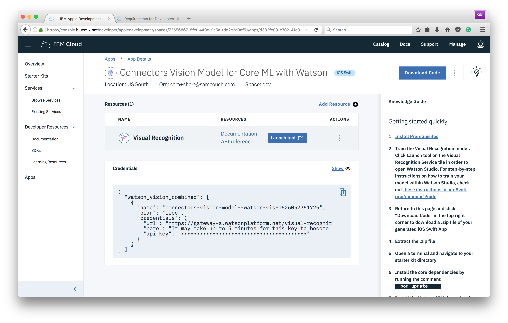
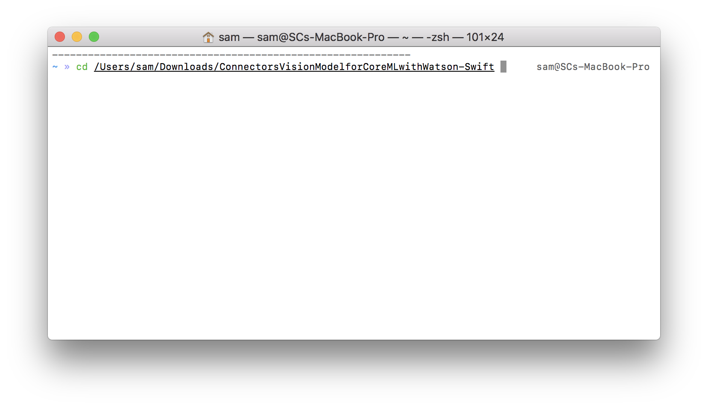

Once your classifier is done training, we can  prepare our iOS application to run.

1. Navigate back to the app console and click **Download Code**

1. Unzip the code
1. From *Launchpad* search for `terminal` and click the icon to open the application

1. Change into the project directory with the following command ***Note: In OS X, you can drag the folder in to the terminal and the path will automatically be inserted***
```bash
cd Downloads/ConnectorsVisionModelforCoreMLwithWatson-Swift
```

1. Install the CocoaPods libraries
```bash
pod update
```

1. Install the Carthage dependancies
```bash
carthage update --platform iOS
```

1. Once the dependancies are all installed, open the folder and open the `ConnectorsVisionModelforCoreMLwithWatson.xcworkspace` file
