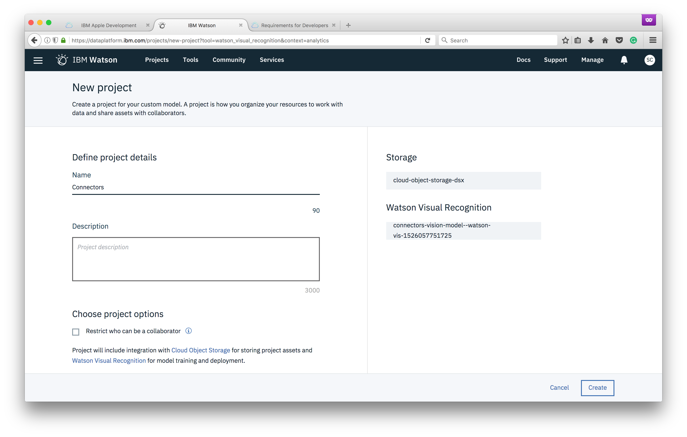

Now that our app is setup, we can begin building our custom visual recognition classifier.

1. Click the **Launch tool** button to access the Visual Recognition service

1. Click the **Create model** button

1. Name the project *Connectors*, then click **Create**

