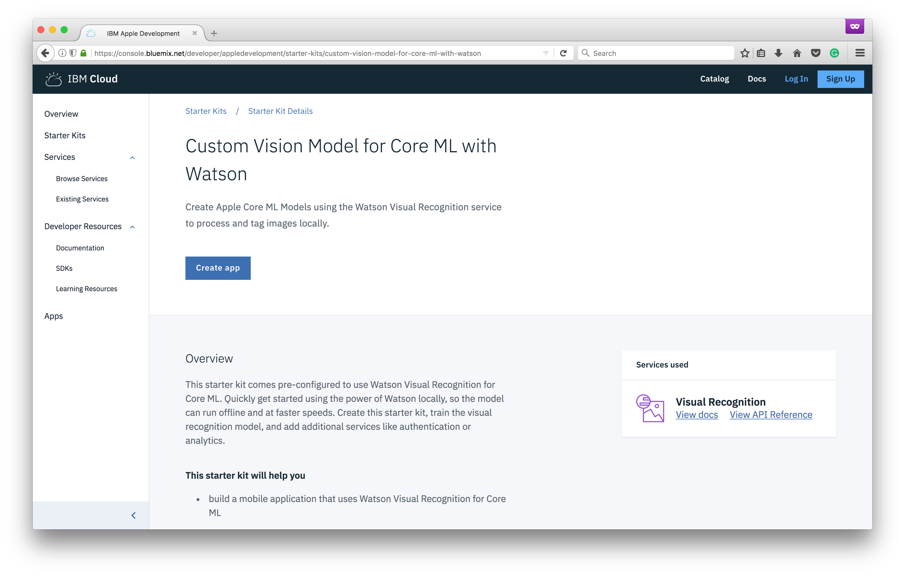

1. Visit the [IBM Cloud Developer Console for Apple](https://console.bluemix.net/developer/appledevelopment/starter-kits/custom-vision-model-for-core-ml-with-watson)

1. Click the **Create App** button
1. Name your app **Connectors Vision Model for Core ML with Watson**, then click **Create**

