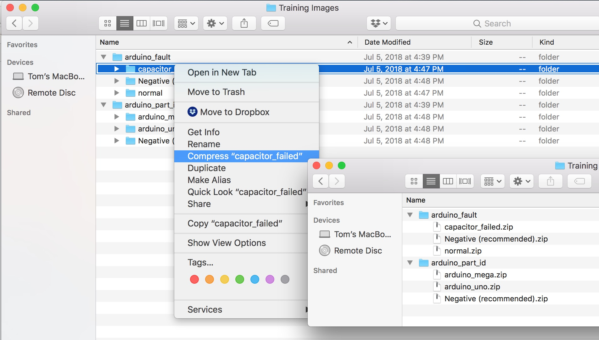

In order to create our model, we have to provide training images to the classifiers. Take a few minutes to take photos of the Arduinos to prepare our multiple data sets.

Make sure to take *at least* **10** images of each Arduino (Uno and Mega). Then take at least 10 images of normal Arduinos and those with a faulted capacitor.

For best results, change the background, lighting, and any other variables that you can think of! (Once you're done taking photos, use Airdrop to transfer the images to your computer.)

# Preparing our data
Next we need to prepare our data by classifying each image into two sets - Arduino part IDs and Arduino faults. 
1. Create an empty folder for each *type* of Arduino

1. Sort through your images, putting each in the correct folder based on the Arduino type and Arduino fault.
1. Once all of your images are in the correct folder, archive each folder to create individual *.zip* files ***Note: on OS X, "compress" is used to create a .zip***

