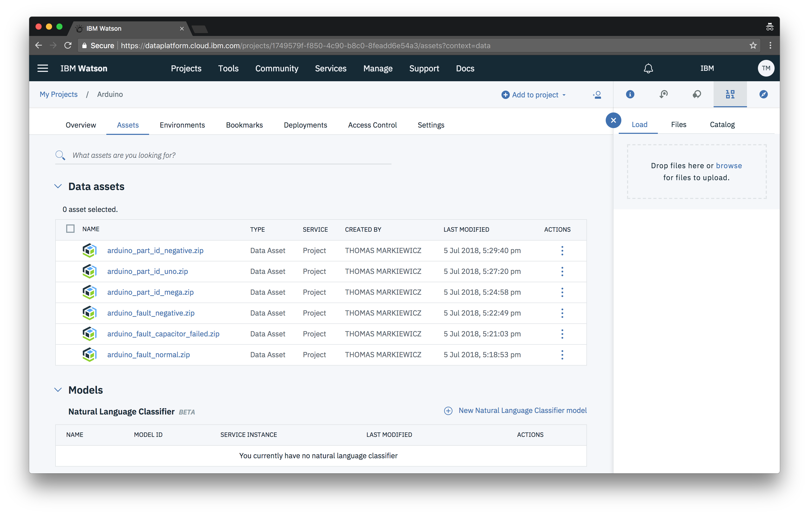

Once your project is created you will be directed to your new project’s page. If you need to find your way back to this page you can get to it by going to **Projects > My First Project** on the top bar.

The most important tabs are **Assets** and **Settings**.

### Settings

The settings page is where we finish setting up our project. We can also change things like the name of our project and the description.

However, the important thing we need to do here now is attach a new Visual Recognition service to our project.

First, ensure that **Watson Tools** is checked under **Tools**. This will unlock special abilities for our project, like creating a new Visual Recognition model. Once checked, make sure you save the change.

In order for us to be able to create a model, we need to spin up a Watson service called Visual Recognition. We can do this by clicking the **Add service** dropdown under **Associated services**.

Choose **Watson**.

And then add Visual Recognition at the bottom.

You can then choose a pricing plan like you did for Object Storage. Then click **Create** and **Confirm** on the following popup.
> **Note:** If you already have a Watson Visual Recognition service, you can choose it by clicking the **Existing** tab.

### Assets

The assets page is where all of you training data will live (It’s also where your visual recognition models will live).

You can upload the training files you created earlier by clicking **browse** or dragging them onto the drop zone.

You should then see a list of your training data show up.

