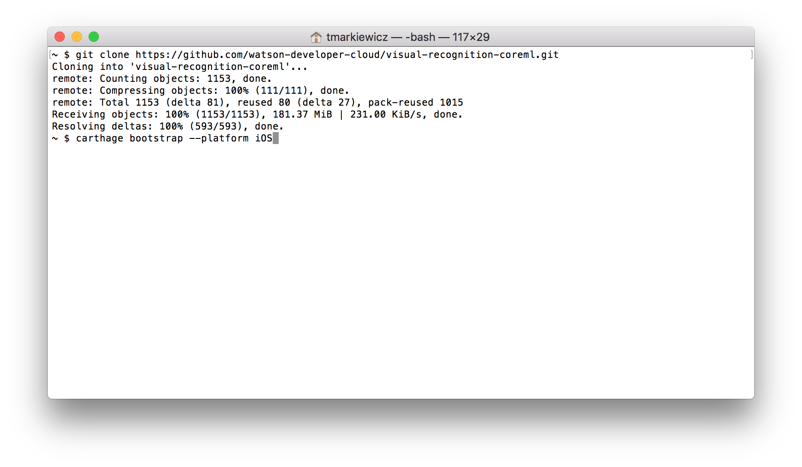

1. From *Launchpad* search for `terminal` and click the icon to open the application

1. Clone the project with the following command
```bash
git clone https://github.com/watson-developer-cloud/visual-recognition-coreml.git
```

1. Change into the project directory with the following command
```bash
cd visual-recognition-coreml/Core\ ML\ Vision\ Custom
```

1. Now we will gather the Watson SDK by executing the following command:
```bash
carthage bootstrap --platform iOS
```

