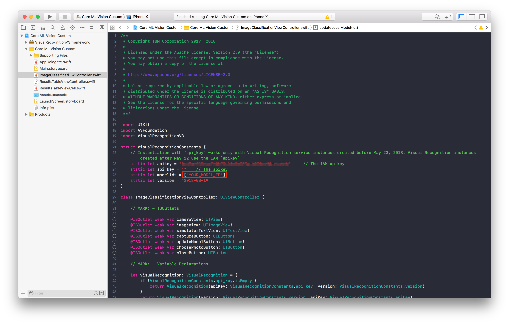

1. Open the project directory in finder. You can do this with the following command
   ```bash
   open .
   ```
1. Then double click the `Core ML Vision Custom.xcodeproj` file to open the project in Xcode

1. In Watson Studio, make your way back to your project's **Assets** tab.

1. Then open your model and copy your **ModelID**. Keep it handy for later.

1. Open the associated visual recognition service.

1. Navigate to the **Credentials** tab.

1. Copy your **"apikey"** and keep it handy for later.

1. Open the file called `ImageClassificationViewController.swift` and add your ModelID.

1. Next, in the same file, add your api key.

