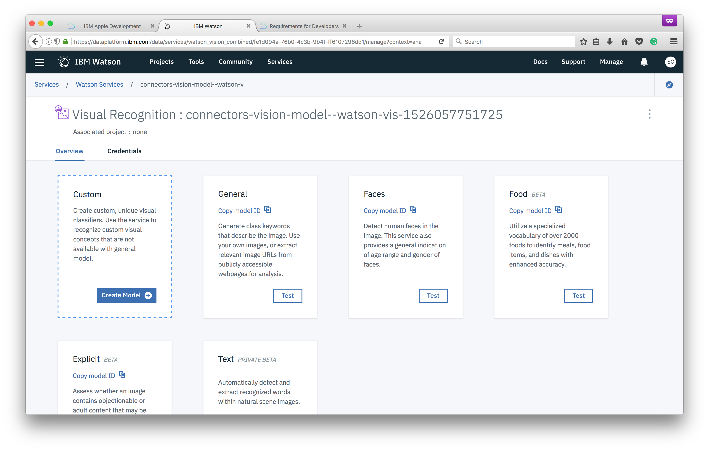

Now that our app is setup, we can begin building our custom visual recognition classifier.

1. Click the **Launch tool** button to access the Visual Recognition service

1. Click the **Create model** button

1. Name the project *Connectors*, then click **Create**

1. Download the [training image dataset](https://github.com/watson-developer-cloud/watson-vision-coreml-code-pattern/releases/download/1.0/Training.Images.zip), and unzip the contents to your desktop
1. On the right side, click **browse** to select the .zip files we just downloaded and unzipped (if you hold *shift*, you can select multiple files at once). Click the **open** button.

1. Click the *...* next to each zip file and select **add to model**

1. Now click **Train model**
